# NotYesterday

**It was five minutes ago. Not yesterday.**



Claude Code knows today's date. What it has no sense of is *when your own work
happened* — nothing in the context says the edit six screens up was four minutes
ago rather than last Tuesday, and after `/compact` even that evidence is gone.
So the model estimates, and estimates drift toward "yesterday".

NotYesterday gives it that sense. It reads the session transcript, does the
arithmetic, and hands Claude the finished answer.

## Install

```
/plugin marketplace add rafet/notyesterday
/plugin install notyesterday@notyesterday
```

Needs `bash` and Python 3.8+. macOS, Linux, Windows via Git Bash. No packages,
no network, no account — it reads files Claude Code already writes.

## What Claude sees

One line on an ordinary turn:

```
⏱ NotYesterday [2026-09-20 15:19]: 47m passed between your previous message and
this one. src/auth.py was last modified today 15:15 (4m ago) — edited in this
session.
```

The full timeline when you come back after an hour, when the day changes, when
you ask "when did you run the tests?", and after every `/compact` or `--resume`:

```
Session started 2026-06-09 13:21 (102d 23h ago).
Context was compacted today 11:20 (1h 11m ago) — work before that point is
summarized, but the times below are exact.
Recent work in this session:
  - src/auth.py — today 11:39 (52m ago)
  - tests/test_auth.py — today 12:22 (9m ago)
  - git commit — yesterday 15:42 (20h 49m ago)
```

A question about time also brings the last few steps of any kind — edits,
commands, searches, subagents — and reaches into this project's other sessions
and your recent commits, so "when did you run the tests?" and "what did we
change last week?" both have answers.

## Settings

`/notyesterday` prints the current state and edits `~/.claude/notyesterday.json`:

| | |
| --- | --- |
| `/notyesterday on` · `off` | all hooks at once |
| `/notyesterday stop log` · `correct` · `off` | the self-check: record, or ask for a correction |
| `/notyesterday tz Europe/Istanbul` | fix the timezone |
| `/notyesterday when` | print the session's edits and compaction points |

MIT.
